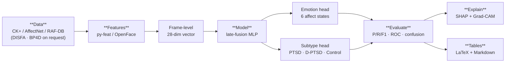
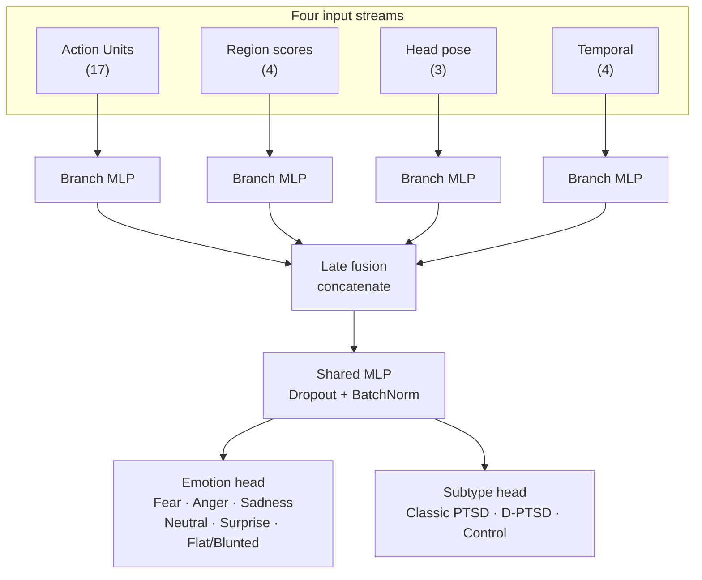

<div align="center">

# Automated Facial Affect Recognition for PTSD Subtype Differentiation

**A multimodal, explainable deep-learning pipeline for research in computational psychopathology**

[](https://colab.research.google.com/github/theSaksham02/PTSD_sub-types_differentiation/blob/main/ptsd-affect-recognition/notebook/PTSD_Affect_Recognition.ipynb)
[](https://www.python.org/)
[](https://pytorch.org/)
[](README.md)
[](README.md)

*Facial action units · region diagnosticity · head-pose dynamics · temporal behaviour → 6 affect states → 3 clinical groups*

</div>

---

## Abstract

**Background.** Post-traumatic stress disorder (PTSD) is clinically heterogeneous, yet the dissociative subtype (D-PTSD) remains difficult to distinguish from classic PTSD using self-report alone. Reduced and dysregulated facial expressivity is a candidate behavioural marker.

**Objective.** Provide a reproducible, end-to-end pipeline that learns facial-affect patterns from **action units (AUs)**, **region-weighted facial scores**, **head-pose dynamics**, and **temporal behavioural features**, and maps them to three groups: *Classic PTSD*, *Dissociative PTSD (D-PTSD)*, and *Healthy Controls*.

**Method.** A multi-input, late-fusion neural network ingests four complementary feature streams, is trained with mixed precision and class-weighted loss on free-tier GPU hardware, and is interrogated with SHAP and Grad-CAM for the paper's Results section.

**Outputs.** Per-class emotion metrics, a highlighted confusion matrix, ROC curves, a PTSD-subtype classification report, and copy-paste-ready LaTeX/Markdown tables.

> ⚠️ **Clinical & ethical notice — read before use.** This is an **experimental research model**, **not** a diagnostic or treatment tool. **No public affect dataset contains PTSD diagnoses** — the six emotion/AU states are derived from public data, while the `Classic PTSD / D-PTSD / Control` labels must be **study-provided** or applied as an **explicitly documented proxy mapping**. Only public or properly authorised data is used; **no private patient identifiers** are processed or stored. See [`DATASET_REPORT.md`](DATASET_REPORT.md) for the clinical-adjacency discussion (DAIC-WOZ / E-DAIC).

---

## Table of Contents

1. [Pipeline Overview](#-pipeline-overview)
2. [Model Architecture](#-model-architecture)
3. [Feature Engineering](#-feature-engineering)
4. [Datasets](#-datasets)
5. [Quick Start](#-quick-start)
6. [Repository Structure](#-repository-structure)
7. [Reproducibility & Evaluation](#-reproducibility--evaluation)
8. [Explainability](#-explainability)
9. [References](#-references)
10. [License & Ethics](#-license--ethics)

---

## 🔬 Pipeline Overview

The notebook follows the structure of a research paper — *Data → Features → Model → Train → Evaluate → Explain* — and runs entirely on Google Colab (free T4 or student A100).



---

## 🧠 Model Architecture

Four parallel branch encoders (each `Linear → BatchNorm → ReLU → Dropout`) embed their input stream independently; the embeddings are concatenated (late fusion) and passed through a shared MLP before two task heads.



| Property | Value |
|---|---|
| Trainable parameters | **27,017** |
| Regularisation | Dropout (0.35) + BatchNorm |
| VRAM management | Mixed precision (AMP) + gradient checkpointing |
| Loss | Class-weighted cross-entropy, both heads |
| Early stopping | Patience = 10 |
| Checkpointing | Google Drive, auto-resume after timeout |

---

## 📐 Feature Engineering

Every face frame is represented by a **28-dimensional vector** assembled from four complementary signals.

| Stream | Dim | Features |
|---|---|---|
| **Action Units** | 17 | `AU01 … AU45` intensities (0–5, FACS convention) |
| **Region weights** | 4 | `eye · mouth · upper_face · lower_face` (diagnosticity-weighted means) |
| **Head pose** | 3 | `yaw · pitch · roll` (degrees) |
| **Temporal** | 4 | `dwell_time · transition_rate · entropy · au_variability` |

**Temporal features** are computed with a *causal* sliding window (`TEMPORAL_WINDOW = 15`) **per sequence**, so statistics never bleed across subjects — a detail that matters for clinical validity. Region scores use **literature-informed diagnosticity weights** (e.g. brow-lowering `AU04`, lid-raising `AU05`, cheek-raising `AU06`, lip-corner `AU12` carry the most signal for blunted/dysregulated affect) and are fully tunable in [`src/config.py`](src/config.py).

---

## 📊 Datasets

Ranked for suitability to PTSD-adjacent AU + temporal modelling. Full rationale, licensing and access instructions: [`DATASET_REPORT.md`](DATASET_REPORT.md).

| Rank | Dataset | AU | Video/Seq | Spontaneous | Access |
|---|---|---|---|---|---|
| 1 | **BP4D / BP4D+** | ✅ FACS + intensity | ✅ 2D+3D | ✅ | Request form |
| 2 | **DISFA / DISFA+** | ✅ 12 AUs @0–5 | ✅ 20 fps | ✅ | Request form |
| 3 | **CK+ (Cohn–Kanade)** | ✅ FACS-coded | ✅ 593 seq | ❌ posed | Direct / Kaggle |
| 4 | **AffectNet** | ❌ landmarks | ❌ static | ❌ in-the-wild | Request / Kaggle |
| 5 | **RAF-DB** | ❌ | ❌ static | ❌ in-the-wild | Kaggle |
| 6 | **OULU-CASIA** | ❌ | ✅ 2,880 seq | ❌ posed | Request |
| 7 | **MAHNOB-HCI** | ⚠️ limited | ✅ video | ✅ naturalistic | Request |

**Colab-ready top-3:** CK+, AffectNet, RAF-DB (auto-downloadable). DISFA and BP4D are the scientific gold standards but are request-gated; the notebook documents their request workflow.

---

## 🚀 Quick Start

<details open>
<summary><b>Run in Google Colab (one click)</b></summary>

1. Click **Open in Colab** (badge above) — or use
   `File → Open notebook → GitHub` and paste this repo URL.
2. **Runtime → Change runtime type → T4 GPU** (free) or **A100** (Pro).
3. Run **Requirements** → **Smoke test** (tiny synthetic end-to-end run) to confirm the environment.
4. Proceed **Data → Features → Model → Train → Evaluate → Explain**.
5. Checkpoints land in Google Drive (`MyDrive/ptsd_affect/checkpoints/`) and training **auto-resumes** after a session timeout.

</details>

<details>
<summary><b>Verify locally (CPU, no GPU required)</b></summary>

```bash
git clone https://github.com/theSaksham02/PTSD_sub-types_differentiation.git
cd PTSD_sub-types_differentiation/ptsd-affect-recognition
python -m venv .venv && source .venv/bin/activate
pip install numpy pandas scikit-learn matplotlib torch
python smoke_test.py          # features → evaluate → tables (15 checks)
python model_smoke_test.py    # model → train → Grad-CAM (11 checks)
```

</details>

---

## 📖 Documentation

Deeper guides live in [`docs/`](docs/README.md):

| Doc | Topic |
|---|---|
| [01 · What is remaining](docs/01_WHAT_IS_REMAINING.md) | Status + blockers |
| [02 · GPU training guide](docs/02_GPU_TRAINING_GUIDE.md) | Colab T4/A100, OOM, resume |
| [03 · Code walkthrough](docs/03_CODE_WALKTHROUGH.md) | File-by-file explanation |
| [04 · Architecture & diagrams](docs/04_ARCHITECTURE.md) | Visual reference (5 figures) |
| [05 · Undergrad researcher guide](docs/05_UNDERGRAD_RESEARCHER_GUIDE.md) | Ethics, design, metrics, writing |

---

## 🗂 Repository Structure

```
ptsd-affect-recognition/
├── notebook/
│   └── PTSD_Affect_Recognition.ipynb   # integrated, self-contained pipeline
├── src/                                # modular source (single source of truth)
│   ├── config.py                       # AU list, classes, dims, seed, paths
│   ├── data_utils.py                   # dataset acquisition + split + integrity
│   ├── features.py                     # 28-dim frame feature extraction
│   ├── model.py                        # multi-input late-fusion model + Grad-CAM backbone
│   ├── train.py                        # AMP + checkpointing + early stopping + resume
│   ├── evaluate.py                     # metrics, confusion, ROC, subtype report
│   ├── explain.py                      # SHAP + Grad-CAM
│   └── tables.py                       # LaTeX / Markdown result tables
├── DATASET_REPORT.md                   # ranked dataset discovery report
├── MANIFEST.md                         # data + artifact provenance ledger
├── docs/                               # documentation + diagrams (see docs/README.md)
│   ├── 01_WHAT_IS_REMAINING.md
│   ├── 02_GPU_TRAINING_GUIDE.md
│   ├── 03_CODE_WALKTHROUGH.md
│   ├── 04_ARCHITECTURE.md
│   ├── 05_UNDERGRAD_RESEARCHER_GUIDE.md
│   └── figures/                        # generated diagrams (5 PNGs)
├── README.md
├── build_notebook.py                   # assembles the .ipynb from src/
├── generate_diagrams.py                # renders docs/figures/*.png
├── smoke_test.py                       # CPU verification (non-GPU parts)
├── model_smoke_test.py                 # CPU verification (PyTorch parts)
└── validate_notebook.py                # proves the inlined notebook executes
```

---

## 🔁 Reproducibility & Evaluation

- **Fixed seed** `SEED = 42` (`config.seed_everything`) across Python / NumPy / PyTorch.
- **Requirements cell** pins the pip-installable stack (PyTorch, py-feat, SHAP, scikit-learn, …).
- **Provenance** is recorded in [`MANIFEST.md`](MANIFEST.md): dataset versions, links, licenses, checksums, label definitions, generated figures, checkpoints and result tables.

**Evaluation outputs** (all figures at 300 dpi, Fathom-style scientific palette):

| Output | File |
|---|---|
| Per-class P / R / F1 (6 emotions) | `figures/table_emotion_metrics.{md,tex}` |
| Confusion matrix (fear–surprise, anger–disgust highlighted) | `figures/confusion_matrix.png` |
| One-vs-rest ROC curves + macro-average | `figures/roc_curves.png` |
| PTSD-subtype report (Accuracy / Macro-F1 / κ) | `figures/table_subtype_metrics.{md,tex}` |

**Verification performed on this build:** `smoke_test.py` → **15/15 checks pass**; `model_smoke_test.py` → **11/11 checks pass** (real PyTorch forward/backward, checkpoint save→resume, Grad-CAM); notebook inlined pipeline executes with `SMOKE TEST PASSED`.

---

## 🔍 Explainability

- **SHAP** — ranks which AU / region / pose / temporal features drive each *subtype* prediction, exported as publication-ready bar charts.
- **Grad-CAM** — overlays class-activation maps on face crops to show the attended facial region per emotion class, via a lightweight CNN backbone used **only** for visualisation.

---

## 📚 References

- Ekman, P., & Friesen, W. V. (1978). *Facial Action Coding System*. Consulting Psychologists Press.
- Lucey, P., et al. (2010). The Extended Cohn-Kanade Dataset (CK+). *CVPR Workshops*.
- Mavadati, S. M., et al. (2013). DISFA: A spontaneous facial action intensity database. *IEEE TAC*.
- Zhang, X., et al. (2014). BP4D-Spontaneous: A high-resolution spontaneous 3D dynamic facial expression database. *Image and Vision Computing*.
- Mollahosseini, A., et al. (2017). AffectNet: A database for facial expression, valence and arousal. *IEEE TAC*.
- Li, S., Deng, W., & Du, J. (2017). Reliable crowdsourcing and deep locality-preserving learning for expression recognition (RAF-DB). *CVPR*.
- Zhao, G., et al. (2011). Facial expression recognition from near-infrared videos (OULU-CASIA). *Image and Vision Computing*.
- Soleymani, M., et al. (2012). A multimodal database for affect recognition and implicit tagging (MAHNOB-HCI). *IEEE TAC*.
- Gratch, J., et al. (2014). The Distress Analysis Interview Corpus (DAIC-WOZ). *LREC*.
- Baltrušaitis, T., et al. (2018). OpenFace 2.0. *IEEE FG*.
- Selvaraju, R. R., et al. (2017). Grad-CAM. *ICCV*.
- Lundberg, S. M., & Lee, S.-I. (2017). A unified approach to interpreting model predictions (SHAP). *NeurIPS*.

---

## ⚖️ License & Ethics

- **Code:** research use; a formal `LICENSE` file is not yet attached — please add one (e.g. MIT/Apache-2.0) before redistribution.
- **Datasets:** each carries its own research license and (for DISFA/BP4D/DAIC-WOZ) a signed academic agreement — see [`DATASET_REPORT.md`](DATASET_REPORT.md) and [`MANIFEST.md`](MANIFEST.md).
- **Ethics:** research-only, non-diagnostic, no private patient identifiers. For any clinical deployment or real patient data, obtain appropriate IRB/ethics approval first.
