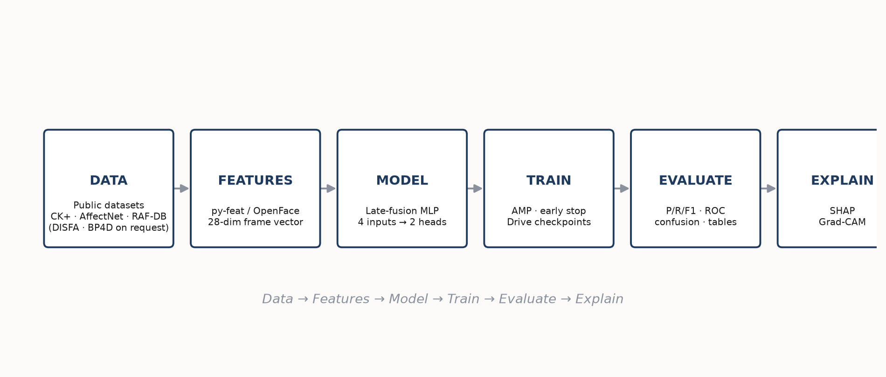
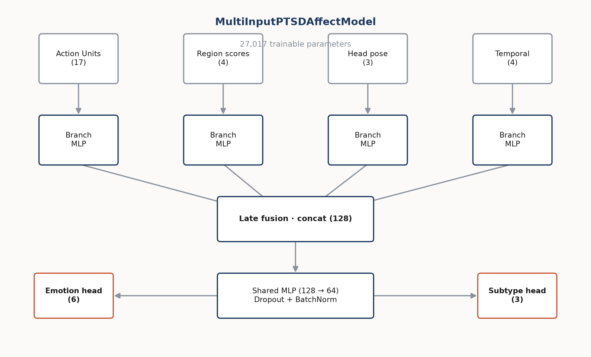
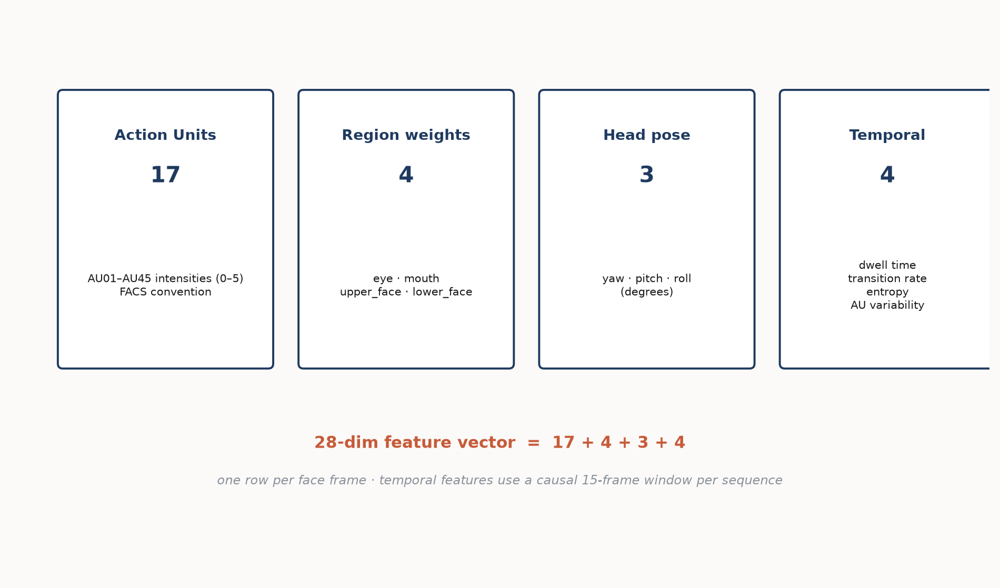
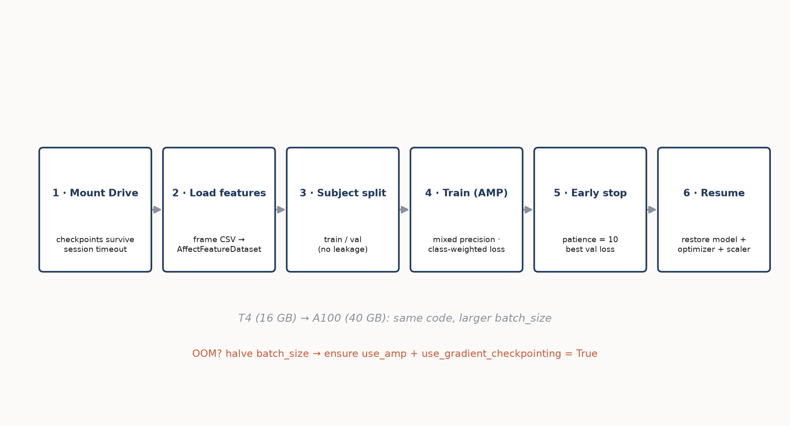
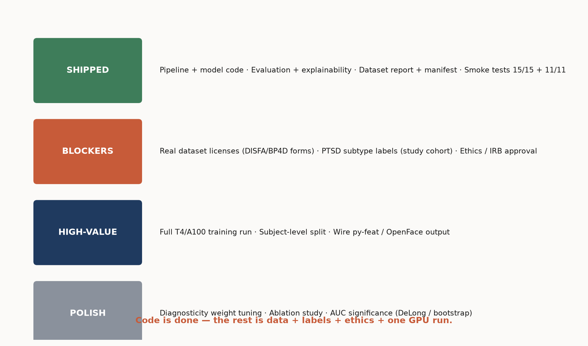

# 04 · Architecture & Diagrams

Visual reference for the pipeline, model, feature schema, training flow, and
research roadmap. All figures are generated from `generate_diagrams.py` and live
in `docs/figures/`.

---

## 4.1 Pipeline overview

Six stages mirror the structure of a research paper's Methods/Results.



| Stage | What happens | Module |
|---|---|---|
| **Data** | Download public datasets (or document requests) | `data_utils.py` |
| **Features** | Extract AU / region / pose / temporal per frame | `features.py` |
| **Model** | 4 inputs → late fusion → 2 heads | `model.py` |
| **Train** | AMP + early stop + Drive checkpoints | `train.py` |
| **Evaluate** | Metrics, confusion, ROC, tables | `evaluate.py` |
| **Explain** | SHAP + Grad-CAM | `explain.py` |

---

## 4.2 Model architecture

Four branch encoders, late-fusion concatenation, shared MLP, two heads.



The design choice — **frame-level features extracted ahead of training, fused
late** — is deliberate: it keeps the model tiny (27k params) so it runs on free
tier, and makes each feature stream individually interpretable (via SHAP).

---

## 4.3 Feature schema (28-dim)



The temporal stream is the most subtle: `dwell_time`, `transition_rate`,
`entropy`, and `au_variability` are computed with a **causal 15-frame window,
per sequence**, which is what lets the model detect *blunted / flat affect*
(restricted, low-entropy facial behaviour) versus *dysregulated* expression.

---

## 4.4 GPU training flow



See [`02_GPU_TRAINING_GUIDE.md`](02_GPU_TRAINING_GUIDE.md) for the exact commands
and the OOM / timeout playbook.

---

## 4.5 Research roadmap (what remains)



See [`01_WHAT_IS_REMAINING.md`](01_WHAT_IS_REMAINING.md) for the itemised list.

---

## Regenerate the diagrams

```bash
python generate_diagrams.py   # rewrites docs/figures/*.png
```

→ Back to [01 · What is remaining](01_WHAT_IS_REMAINING.md)
